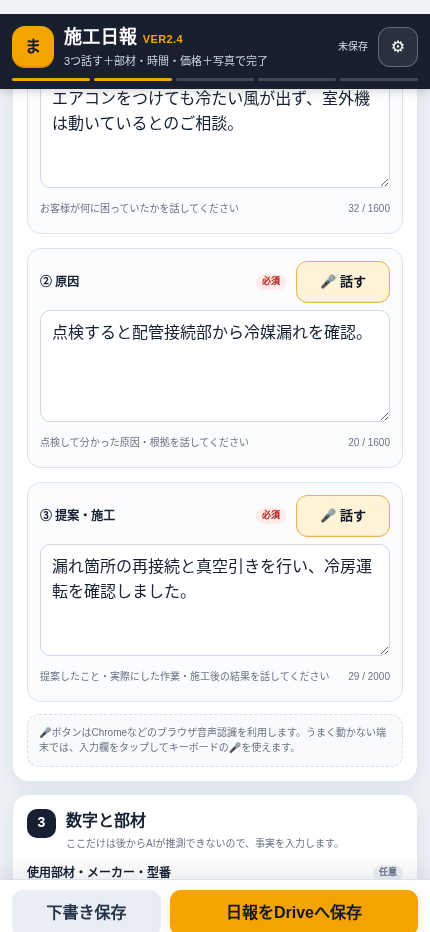
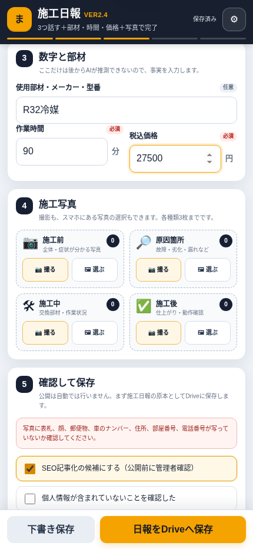

# massugu-report

音声入力・写真・Google Drive保存・PWA・オフライン再送に対応した、現場向け施工日報Webアプリのサンプルです。

> HTML + JavaScript + Google Apps Script + Google Drive / Google Sheets で構成しています。

## Demo

実際の画面はこちらです。

**https://massugu-denki.jp/massugu_report_v1/**

公開デモには、実運用のGAS URLやシークレットキー（appToken）は含まれていません。
そのため、通常アクセスしただけではGoogle Driveへ日報は保存されません。





## Features

- 音声入力
  - Web Speech API / SpeechRecognition を利用
  - 「困りごと」「原因」「提案・施工」を話してその場で文字化
  - 電気・エアコン工事の専門用語を認識ヒントとして登録
- 施工写真
  - その場でカメラ撮影
  - 既存写真から選択
  - ブラウザ側で画像を縮小してから送信
- Google Drive保存
  - GASが年月・日報IDごとに自動でフォルダを作成
  - 写真と report.json をまとめて保存
- Google Sheets管理台帳
  - 1日報＝1行で目次化
  - DriveフォルダID、作業時間、金額、AI状態などを管理
- PWA
  - スマホのホーム画面へ追加可能
  - アプリ風に起動
- オフライン対応
  - 通信できない場合は端末内のIndexedDBへ未送信データを保存
  - 通信復帰時または次回起動時に再送

## Architecture

```text
スマホ / PWA
    |
    | 1. start
    v
Google Apps Script
    |
    | 日報フォルダ作成
    |
    | 2. upload（写真ごと）
    v
Google Drive
    |
    | 3. finalize
    v
report.json 作成
    |
    +--> Google Sheets に1行追加
```

写真をすべて1回の通信で送らず、start -> upload -> finalize の3段階に分けています。
これにより、大きなデータ送信や通信切断の影響を減らしています。

## File structure

```text
massugu-report/
├─ index.html
├─ sw.js
├─ manifest.webmanifest
├─ icon-192.png
├─ icon-512.png
├─ gas/
│  ├─ Code.gs
│  └─ appsscript.json
├─ screenshots/
│  ├─ voice-input.png
│  └─ photo-input.png
├─ .gitignore
├─ PUBLIC_CHECKLIST.md
└─ README.md
```

## Setup

### 1. Google Apps Scriptを作る

Google Apps Scriptで新しいプロジェクトを作成し、gas/Code.gs の内容を貼り付けます。

必要に応じてプロジェクト設定から appsscript.json を表示し、gas/appsscript.json の内容を反映してください。

### 2. setup() を実行する

Apps Script上で setup() を1回実行します。

自動で以下が作成されます。

- Google Drive: 施工日報保管庫
- Google Spreadsheet: 施工日報管理台帳
- appToken（アプリキー）

appToken は実行ログに初回のみ表示されるため、安全な場所に控えてください。

### 3. GASをWebアプリとしてデプロイする

- 実行するユーザー: 自分
- アクセスできるユーザー: 運用に合わせて設定

デプロイ後、/exec で終わるWebアプリURLを控えます。

### 4. フロントエンドをHTTPSで公開する

index.html、sw.js、manifest.webmanifest、アイコンを同じディレクトリへ配置します。

例:

```text
https://example.com/report/
```

マイク・PWA・Service Workerを使うため、HTTPSでの公開を推奨します。

### 5. アプリ側にGAS URLとappTokenを設定

日報画面右上の設定から、

- GAS WebアプリURL
- appToken

を入力し、「接続テスト」を実行します。

## Security

このリポジトリには以下を含めないでください。

- 実運用の appToken
- 実運用のGAS /exec URLを埋め込んだコード
- 顧客情報
- Google Drive / Spreadsheetの個別ID
- その他の秘密鍵・APIキー

フロント側でもGAS URL / appTokenが未設定なら保存処理へ進まず、GAS側でも appToken を検証してからDrive操作を行います。

ただし、これは汎用的な認証基盤ではありません。利用者数が多い場合や機密性の高い用途では、Googleログイン等を含む認証・認可の追加を検討してください。

## SpeechRecognitionについて

Web Speech APIの SpeechRecognition は、ブラウザやOSによって対応状況・認識精度が異なります。

このサンプルでは、対応しているブラウザでは電気・エアコン工事の専門用語を認識ヒントとして渡し、未対応の場合は通常の音声認識へフォールバックする設計です。

## Future ideas

- 日報をAIで自動記事化
- WordPressへ下書き登録
- Search Consoleデータとの連携
- 日報からFAQ・施工事例・地域ページを自動生成
- kintoneなど既存業務システムとの連携

## License

現時点ではライセンスを設定していません。
第三者に自由な利用・改変・再配布を許可する場合は、MIT Licenseなどの追加をおすすめします。
